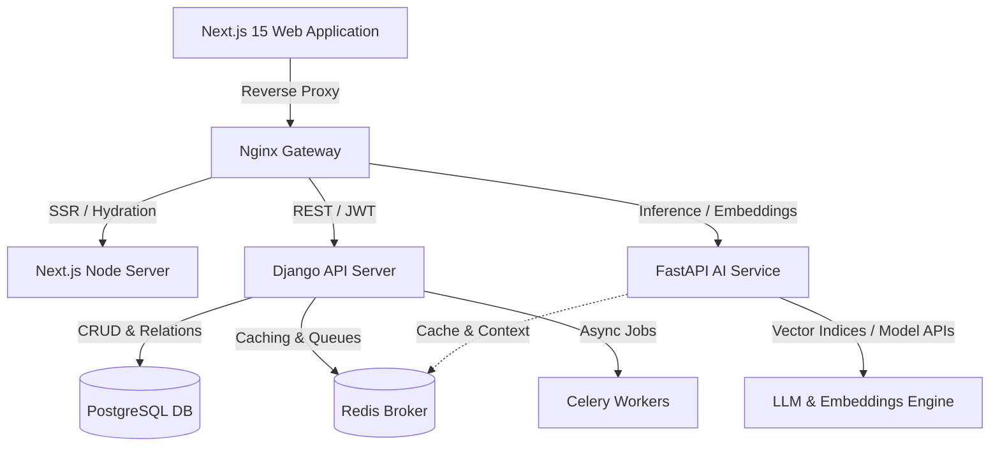

# System Design & Architecture

## Overview
The Academia–Industry Collaboration Platform is architected as a modular, cloud-ready ecosystem connecting four primary stakeholders: Students, Industries, Academicians, and Institutions.

## Stakeholder Roles
1. **Student**: Career guidance, skill benchmarking, gap-remediation, micro-internships, placement matching.
2. **Industry**: Talent pipeline, automated job description intelligence, candidate matching, internship governance.
3. **Academician**: Faculty development programs (FDPs), industry internships, applied research collaborations, and mentorship.
4. **Institution**: Real-time batch skill heatmaps, employability analytics, compliance reporting, placement drives.
5. **Super Admin**: Verification authority, audit trail monitoring, platform governance.
