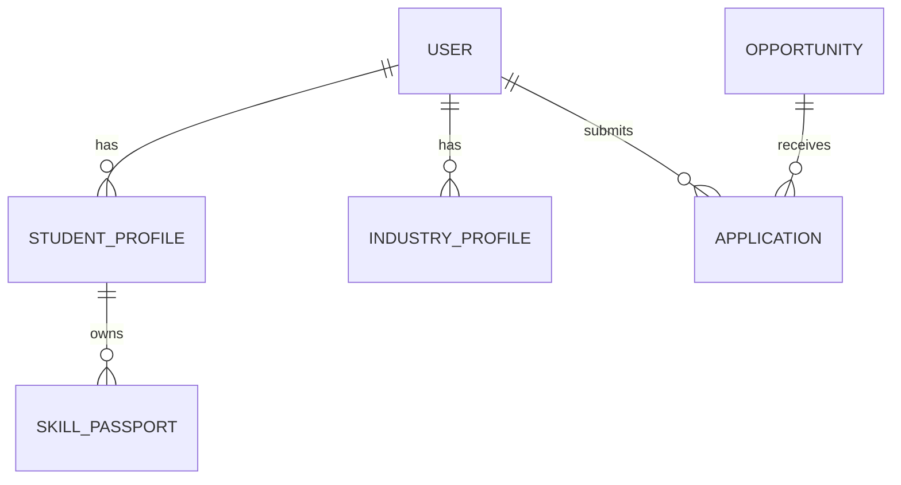

# Entity Relationship Diagram (ERD)

```mermaid
erDiagram
    USER ||--o{ STUDENT_PROFILE : has
    USER ||--o{ INDUSTRY_PROFILE : has
    USER ||--o{ APPLICATION : submits
    OPPORTUNITY ||--o{ APPLICATION : receives
    STUDENT_PROFILE ||--o{ SKILL_PASSPORT : owns
```
