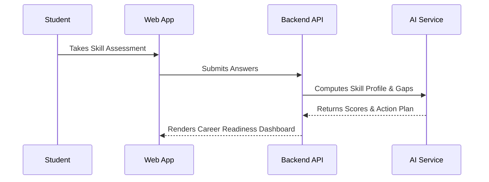

# Core User Flow

```mermaid
sequenceDiagram
    participant S as Student
    participant W as Web App
    participant B as Backend API
    participant AI as AI Service

    S->>W: Takes Skill Assessment
    W->>B: Submits Answers
    B->>AI: Computes Skill Profile & Gaps
    AI-->>B: Returns Scores & Action Plan
    B-->>W: Renders Career Readiness Dashboard
```
